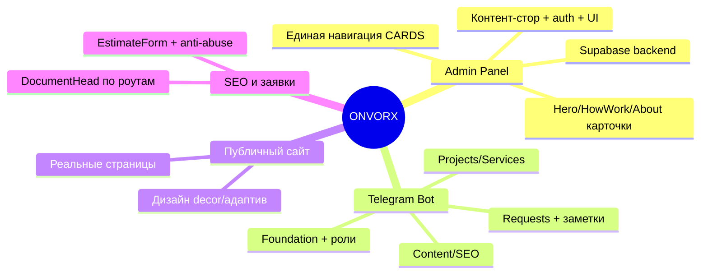

# ONVORX — Карта проекта

Живая карта задач по направлениям. Обновляется мной при старте и завершении каждого проекта — не нужно вести отдельно, просто открывай этот файл, чтобы увидеть, что сделано, а что нет. GitHub рендерит диаграмму ниже прямо в интерфейсе.

Ссылки на детали — в `docs/superpowers/specs/` (дизайн) и `docs/superpowers/plans/` (реализация) для каждого завершённого проекта.

---

## ✅ Admin panel (`/admin`)

- [x] Контент-стор, авторизация, UI панели (localStorage-версия) — [spec](superpowers/specs/2026-09-08-admin-panel-design.md) · [plan 1](superpowers/plans/2026-09-08-admin-plan-1-content-store.md) · [plan 2](superpowers/plans/2026-09-08-admin-plan-2-auth.md) · [plan 3](superpowers/plans/2026-09-08-admin-plan-3-ui.md)
- [x] Supabase backend (схема, публичное чтение, запись из админки, хардненинг) — [spec](superpowers/specs/2026-09-09-supabase-integration-design.md) · [plan 1](superpowers/plans/2026-09-09-supabase-plan-1-foundation.md) · [plan 2](superpowers/plans/2026-09-09-supabase-plan-2-public-read.md) · [plan 3](superpowers/plans/2026-09-09-supabase-plan-3-admin-write.md) · [plan 4](superpowers/plans/2026-09-10-supabase-plan-4-hardening.md)
- [x] Hero/HowWork/About карточки + футер-теглайн → редактируемые из админки, загрузка SVG-иконок с санитайзингом — [spec](superpowers/specs/2026-09-14-admin-hero-howwork-about-cards-design.md) · [plan](superpowers/plans/2026-09-14-admin-hero-howwork-about-cards.md)
- [x] Единая навигация CARDS (Hero/HowWork/About/Projects/Services под одним разделом) — [spec](superpowers/specs/2026-09-14-admin-cards-nav-restructure-design.md) · [plan](superpowers/plans/2026-09-14-admin-cards-nav-restructure.md)

## ✅ Telegram-бот (управление сайтом из Telegram)

- [x] Фундамент бота, ролевой доступ (owner/content_manager/sales_manager) — [spec](superpowers/specs/2026-09-12-telegram-bot-admin.md) · [plan 1](superpowers/plans/2026-09-12-telegram-bot-plan-1-foundation.md)
- [x] Редактирование Content/SEO из бота — [plan 2](superpowers/plans/2026-09-12-telegram-bot-plan-2-content-seo.md)
- [x] Карточки Projects/Services из бота — [plan 3](superpowers/plans/2026-09-13-telegram-bot-plan-3-projects-services.md)
- [x] Заявки (Requests): фильтр, статус, заметки, удаление — [plan 4](superpowers/plans/2026-09-13-telegram-bot-plan-4-requests.md)
- [x] История заметок по заявке (общая для веб и бота) — [spec](superpowers/specs/2026-09-13-request-notes-history-design.md) · [plan](superpowers/plans/2026-09-13-request-notes-history.md)
- [ ] Управление карточками Hero/HowWork/About из бота — **явно не запланировано** (решение пользователя: функционал бота не расширяем)

## ✅ Публичный сайт — дизайн и адаптив

- [x] Hero: decor-волны, центральный элемент (hero_central_decor), радар, компактные карточки
- [x] CTA: rings-декор по размеру макета, edge-to-edge секция
- [x] Services/HowWork/Footer: z-index и высота decor-волны над контентом
- [x] Адаптив laptop/tablet/mobile: HowWork sub-text, About-разделители и центрирование, Footer brand row/column, Hero launch-карточка
*(без формального spec/plan — итеративные фиксы по скриншотам, ветка `fix/hero-services-cta-decor-widths`, смержена)*

## 🔲 Публичный сайт — недостающие страницы

- [ ] `/services` — сейчас общая заглушка "coming soon"
- [ ] `/about` — заглушка
- [ ] `/web-development`, `/support`, `/business-analysis` — заглушки
- [ ] `/projects` — отдельной страницы нет вообще (в навигации ведёт на якорь `/#projects` на главной)
- [ ] `/projects/:id` — карточка проекта, ссылки есть, роута нет
- [ ] `/google-ads` — в навигации не встречается, роута нет

## ✅ SEO и заявки

- [x] `<DocumentHead>` — per-route title/meta из стора (8 ключей страниц)
- [x] `<EstimateForm>` — модалка отправки заявки, пишет в Supabase
- [x] Anti-abuse на `/api/estimate` (honeypot + rate-limit)
- [ ] `meta`-узел в i18n JSON — мёртвый, не используется (мелкий cleanup, не блокирует ничего)

---

## Как обновлять

Я веду этот файл сам: отмечаю пункт `[x]` и добавляю ссылки на spec/plan сразу после мержа каждого проекта в `main`. Если начинаем что-то новое — сначала попадает сюда как `[ ]` с кратким описанием, до всякого brainstorming/spec/plan.
